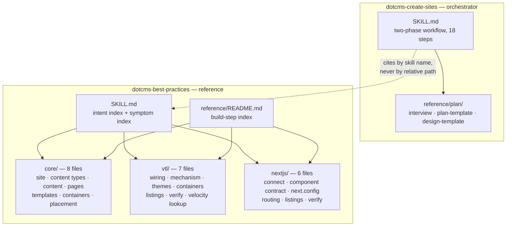
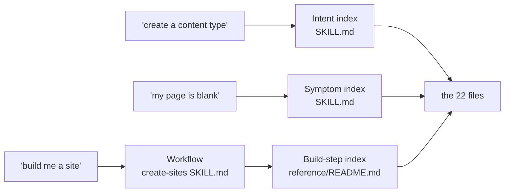
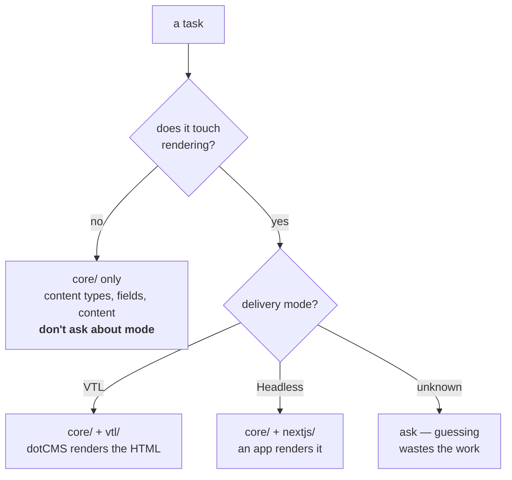
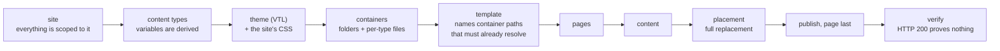
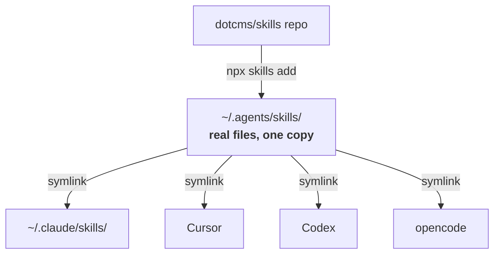
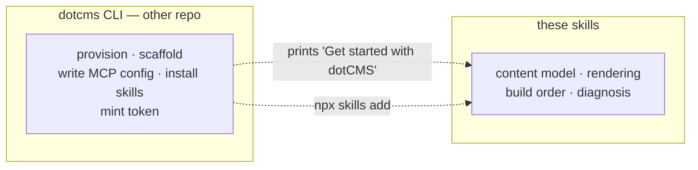

# Skill system architecture

**Updated:** 2026-09-01 · **Scope:** what ships from `dotcms/skills`. The CLI is a separate
system — see `PLAN.md` §8 and `../core/docs/cli/CLI_DISTRIBUTION_PLAN.md`.

The whole design in one sentence: **one reference corpus, three indexes over it, two entry
skills.**

---

## 1. The pieces

**Why the citation is by name, not path.** The installer puts real files in
`~/.agents/skills/<skill>/` and symlinks them into each agent's directory. A relative path
like `../dotcms-best-practices/reference/core/00-…` resolves differently depending on which
path the agent walked to get there. Naming the skill lets the agent resolve it.

## 2. Three indexes, one corpus

The 22 reference files are written once and indexed three ways, because the same file answers
different questions depending on why you arrived.

| Index | Keyed by | Lives in | Answers |
|---|---|---|---|
| **Intent** | what you want to do | `best-practices/SKILL.md` | "create a content type" → `core/02` |
| **Symptom** | what you're seeing | `best-practices/SKILL.md` | "shell renders, slots missing" → mode-labeled causes |
| **Build step** | dependency order | `reference/README.md` | step 12b of a full build → `core/06` |

**The symptom index is the one that isn't just a table of contents.** It forks on
blank-vs-shell-only first, labels every row with its delivery mode, and exists because every
failure in dotCMS returns **HTTP 200**. A build-step index cannot answer "why is this blank."

## 3. The delivery-mode fork

Every rendering task branches. Content-model work does not.

Both branches share the same numbering — `00` wire up · `01` type↔renderer contract ·
`02`–`03` mode plumbing · `04` listings & detail · `05` verify — so a shared step is the same
number in either mode.

**The asymmetry that matters:** in headless, the app wiring may already exist and the skill
tells you to detect it. In VTL, every file is authored from nothing.

## 4. Build dependency order

What `reference/README.md` encodes, and why the order isn't negotiable.

Two loops the diagram flattens: a URL-mapped type needs `urlMapPattern` and `detailPage`
patched back **after** its detail page exists, and a template edit needs a re-publish before
the change reaches LIVE.

## 5. How it reaches a machine

One copy, N links — so an update propagates without reinstalling. Skills ship **unversioned**;
nothing tells a developer theirs describes an older dotCMS. That's an accepted risk, recorded
in `PLAN.md` §5, not an oversight.

## 6. Where the CLI stops

| Concern | Owner |
|---|---|
| Headless app wiring | **CLI writes it** — the skill detects and extends it |
| Traditional/VTL structure | CLI writes only a directory; **the skill owns everything inside** |
| The hand-off sentence | CLI prints it; **the skills must answer it well** |
| MCP server identity | manifests here and CLI configs must name the same server |

**The skills never assume the CLI ran.** They detect what exists — dotCMS deps in
`package.json`, an existing `createDotCMSClient`, a components object, a catch-all route — and
fill only the gaps. A registry install with no CLI anywhere is a supported path.

---

## The one rule underneath all of it

**Nothing fails loudly.** A missing theme loop, an empty `postloop.vtl`, a wrong-case component
key, content over `max_contentlets`, a container path that doesn't resolve — every one returns
**HTTP 200** with no error. That single fact is why the corpus is organised around failure modes
rather than API surface, why every build path ends in an explicit verify step, and why the
symptom index exists at all.
